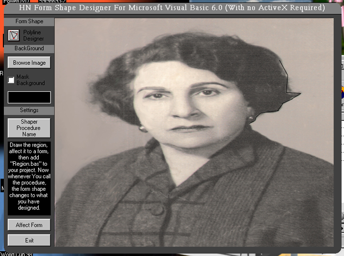



## A different Window Shape Designer \(Corrected Version\)

### Description

An easy-to-use program to DRAW a shape for your form. Just several clicks ... and you have a beautiful-shaped form designed by yourself! See it and vote for it.I'll appreciate your vote.
 
### More Info
 

             |
---                |---
**Submitted On**   |2001-07-24 06:22:38
**By**             |[Hesan Feghhi](https://github.com/Planet-Source-Code/PSCIndex/blob/master/ByAuthor/hesan-feghhi.md)
**Level**          |Intermediate
**User Rating**    |5.0 (70 globes from 14 users)
**Compatibility**  |VB 5\.0, VB 6\.0
**Category**       |[Complete Applications](https://github.com/Planet-Source-Code/PSCIndex/blob/master/ByCategory/complete-applications__1-27.md)
**World**          |[Visual Basic](https://github.com/Planet-Source-Code/PSCIndex/blob/master/ByWorld/visual-basic.md)
**Archive File**   |[A differen233597232001\.zip](https://github.com/Planet-Source-Code/hesan-feghhi-a-different-window-shape-designer-corrected-version__1-25392/archive/master.zip)

